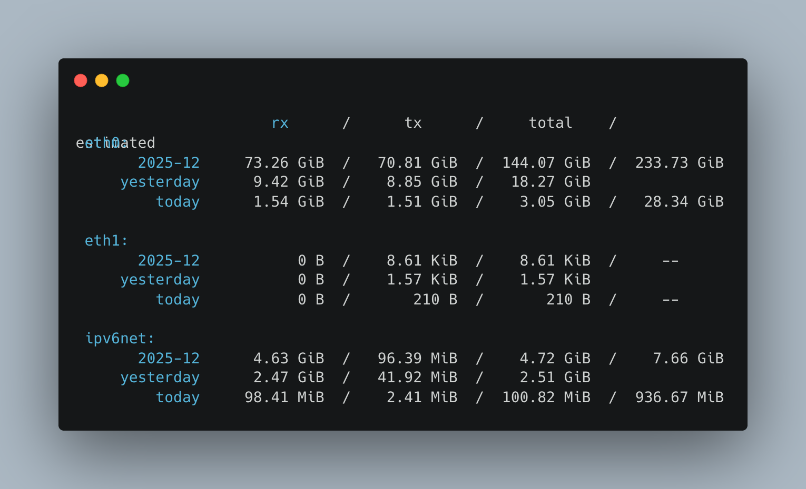
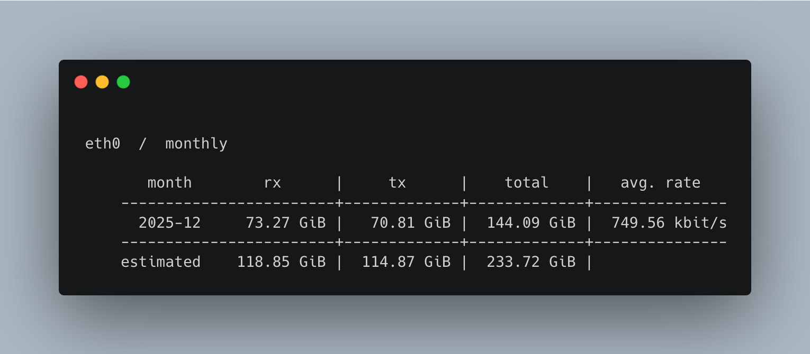
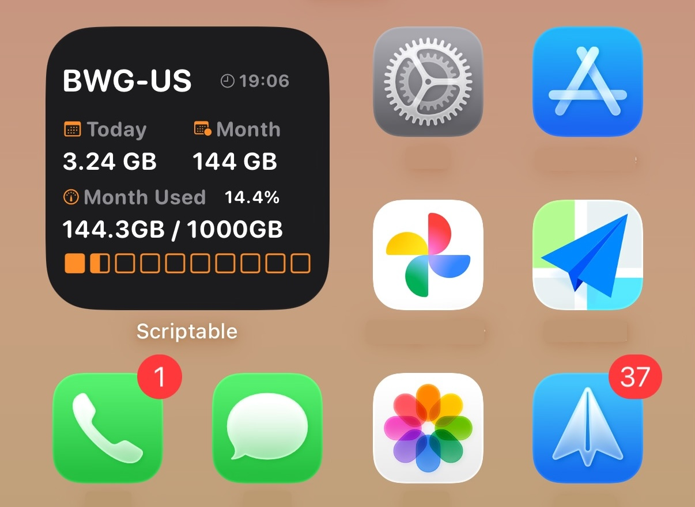

# vnstat-http-server

[](https://opensource.org/licenses/MIT)
[](https://golang.org/)
[](https://github.com/kchen0x/vnstat-http-server/releases/latest)
[](https://github.com/kchen0x/vnstat-http-server)
[](https://github.com/kchen0x/vnstat-http-server)

**Language / 语言**: [English](README.md) | [中文](README.zh-CN.md)

---

A lightweight single-file tool written in Go that exposes vnstat statistics from Linux servers via HTTP API, enabling remote monitoring by mobile apps, web frontends, scripts, and monitoring systems like Grafana Cloud.

## Features

- 🚀 **Zero Dependencies**: No need to install Python, PHP, Node, or Docker (except vnstat itself)
- 📦 **Single Binary**: Just one file after compilation, ready to run
- 🔒 **Secure**: Simple token-based authentication support
- 🌐 **CORS Support**: All endpoints support cross-origin requests
- 📊 **Multiple Formats**: Supports both JSON and plain text output
- 📈 **Prometheus Metrics**: Exposes `/metrics` endpoint in Prometheus format
- ☁️ **Grafana Cloud Integration**: Built-in push to Grafana Cloud with Protobuf + Snappy compression
- 🏷️ **Multi-Server Support**: Automatic hostname labels for distinguishing multiple servers
- 📱 **iOS Widget**: Scriptable widget for iPhone home screen monitoring

## Requirements

- Linux system (amd64 / arm64)
- `vnstat` tool installed ([Installation Guide](https://humdi.net/vnstat/))
- Go 1.21+ (only needed for compilation)

## Quick Start

### 1. Download Pre-built Binaries

Pre-built binaries are available in [Releases](https://github.com/kchen0x/vnstat-http-server/releases).

**Latest Release**: [Latest](https://github.com/kchen0x/vnstat-http-server/releases/latest)

Download the appropriate binary for your system:
- `vnstat-http-server-linux-amd64` - For Linux x86_64 systems
- `vnstat-http-server-linux-arm64` - For Linux ARM64 systems

After downloading, make it executable:
```bash
chmod +x vnstat-http-server-linux-amd64
```

### 2. Build from Source

If you prefer to build from source:

```bash
make build
```

After compilation, binary files are located in the `bin/` directory:
- `bin/vnstat-http-server-linux-amd64`
- `bin/vnstat-http-server-linux-arm64`

### 3. Run

```bash
# Basic run (no authentication)
./bin/vnstat-http-server-linux-amd64 -port 8080

# Enable token authentication
./bin/vnstat-http-server-linux-amd64 -port 8080 -token your-secret-token

# Specify network interface
./bin/vnstat-http-server-linux-amd64 -port 8080 -token your-secret-token -interface eth0
```

### 4. Command Line Arguments

- `-port`: Listening port, default `8080`
- `-token`: Authentication token, default empty (no authentication)
- `-interface`: (Optional) Specify network interface name, default empty (query all)
- `-grafana-url`: (Optional) Grafana Cloud Prometheus remote write URL. When set with `-grafana-user` and `-grafana-token`, enables automatic metrics pushing
- `-grafana-user`: (Optional) Grafana Cloud instance ID
- `-grafana-token`: (Optional) Grafana Cloud API token (requires `MetricsPublisher` role)
- `-grafana-interval`: (Optional) Interval for pushing metrics to Grafana Cloud, default `30s`

## API Endpoints

All endpoints support CORS cross-origin requests and can be authenticated via query parameter `?token=YOUR_TOKEN` (if token is enabled).

### 1. Get JSON Data

**Endpoint**: `GET /json`

**Description**: Returns complete vnstat JSON data with all statistics

**Parameters**:
- `token` (optional): Required if authentication is enabled

**Response**: `Content-Type: application/json`

**Example**:
```bash
curl http://localhost:8080/json?token=your-secret-token
```

### 2. Text View Endpoints

The following endpoints return `Content-Type: text/plain; charset=utf-8` formatted text data.

#### 2.1 Default Summary View

**Endpoint**: `GET /summary`

**Description**: Returns vnstat's default summary view showing overall statistics

**Example**:
```bash
curl http://localhost:8080/summary?token=your-secret-token
```

**Example Output**:


#### 2.2 Monthly View

**Endpoint**: `GET /` or `GET /monthly`

**Description**: Returns monthly traffic statistics view (default endpoint)

**Example**:
```bash
curl http://localhost:8080/?token=your-secret-token
```

**Example Output**:


#### 2.3 Daily View

**Endpoint**: `GET /daily`

**Description**: Returns daily traffic statistics view

**Example**:
```bash
curl http://localhost:8080/daily?token=your-secret-token
```

#### 2.4 Hourly View

**Endpoint**: `GET /hourly`

**Description**: Returns hourly traffic statistics view

**Example**:
```bash
curl http://localhost:8080/hourly?token=your-secret-token
```

#### 2.5 Weekly View

**Endpoint**: `GET /weekly`

**Description**: Returns weekly traffic statistics view

**Example**:
```bash
curl http://localhost:8080/weekly?token=your-secret-token
```

#### 2.6 Yearly View

**Endpoint**: `GET /yearly`

**Description**: Returns yearly traffic statistics view

**Example**:
```bash
curl http://localhost:8080/yearly?token=your-secret-token
```

#### 2.7 Top Traffic Interfaces

**Endpoint**: `GET /top`

**Description**: Returns list of top traffic network interfaces

**Example**:
```bash
curl http://localhost:8080/top?token=your-secret-token
```

#### 2.8 One-line Output

**Endpoint**: `GET /oneline`

**Description**: Returns concise one-line format output, suitable for script parsing

**Example**:
```bash
curl http://localhost:8080/oneline?token=your-secret-token
```

### 3. Prometheus Metrics

**Endpoint**: `GET /metrics`

**Description**: Returns Prometheus format metrics for integration with monitoring systems like Grafana Cloud, Prometheus, etc.

**Response**: `Content-Type: text/plain; version=0.0.4; charset=utf-8`

**Metrics Provided**:
- `vnstat_traffic_total_bytes{interface="<name>",direction="rx|tx"}` - Total traffic in bytes
- `vnstat_traffic_month_bytes{interface="<name>",direction="rx|tx"}` - Monthly traffic in bytes
- `vnstat_traffic_today_bytes{interface="<name>",direction="rx|tx"}` - Today's traffic in bytes

**Example**:
```bash
# Without authentication (if token is not set)
curl http://localhost:8080/metrics

# With authentication (if token is set)
curl http://localhost:8080/metrics?token=your-secret-token
```

**Example Output**:
```
# HELP vnstat_traffic_total_bytes Total traffic in bytes
# TYPE vnstat_traffic_total_bytes counter
vnstat_traffic_total_bytes{interface="eth0",direction="rx"} 1234567890
vnstat_traffic_total_bytes{interface="eth0",direction="tx"} 987654321
vnstat_traffic_month_bytes{interface="eth0",direction="rx"} 123456789
vnstat_traffic_month_bytes{interface="eth0",direction="tx"} 98765432
vnstat_traffic_today_bytes{interface="eth0",direction="rx"} 1234567
vnstat_traffic_today_bytes{interface="eth0",direction="tx"} 987654
```

### 4. Health Check

**Endpoint**: `GET /health`

**Description**: Health check endpoint, no authentication required

**Response**: `Content-Type: application/json`

**Example**:
```bash
curl http://localhost:8080/health
```

**Response Example**:
```json
{
  "status": "ok"
}
```

## Endpoint Summary

| Endpoint | Function | Output Format | Use Case |
|----------|----------|---------------|----------|
| `/json` | Complete JSON data | JSON | API integration, data analysis |
| `/metrics` | Prometheus metrics | Prometheus | Grafana Cloud, Prometheus integration |
| `/summary` | Default summary | Text | Quick overview |
| `/daily` | Daily statistics | Text | Daily traffic trends |
| `/hourly` | Hourly statistics | Text | Hourly traffic changes |
| `/weekly` | Weekly statistics | Text | Weekly traffic trends |
| `/` or `/monthly` | Monthly statistics | Text | Monthly traffic statistics |
| `/yearly` | Yearly statistics | Text | Annual traffic summary |
| `/top` | Top interfaces | Text | Highest traffic interfaces |
| `/oneline` | One-line output | Text | Script parsing, monitoring alerts |

## iOS Scriptable Widget

The project includes a Widget script designed for iOS Scriptable, which can display server traffic statistics on iPhone home screen in 4x4 small size.

### Quick Start

1. Install [Scriptable](https://apps.apple.com/app/scriptable/id1405459188) from App Store
2. Create a new script in Scriptable and copy the content of `vnstat-widget.js`
3. Modify `SERVER_URL` and `TOKEN` configuration in the script
4. Add Scriptable Widget to iPhone home screen (select Small size)
5. Select your created script

### Detailed Documentation

For complete usage instructions, configuration options, and troubleshooting, please refer to: [SCRIPTABLE_WIDGET.md](./SCRIPTABLE_WIDGET.md)

### Widget Features

- 📱 Perfect fit for 4x4 Widget size
- 🎨 Auto-adapts to dark/light mode
- 📊 Displays today, monthly traffic and monthly usage progress
- 📈 Visual progress bar with half-fill support
- 🔄 Configurable refresh interval (default 5 minutes)
- ⚡ Fast response, 10 second timeout

**Widget Preview**:


## Grafana Cloud Integration

The `/metrics` endpoint provides Prometheus-format metrics that can be easily integrated with Grafana Cloud.

**Grafana Dashboard Preview**:


### Option 1: Built-in Push (Recommended - Lightweight)

The server includes built-in support for pushing metrics directly to Grafana Cloud. This is the most lightweight option with zero additional dependencies.

**Usage**:

```bash
./vnstat-http-server \
  -port 8080 \
  -token your-token \
  -grafana-url "https://YOUR_PROMETHEUS_INSTANCE.grafana.net/api/prom/push" \
  -grafana-user "YOUR_INSTANCE_ID" \
  -grafana-token "YOUR_API_TOKEN" \
  -grafana-interval 30s
```

**Note**: Replace `YOUR_PROMETHEUS_INSTANCE` with your actual Grafana Cloud Prometheus instance URL. You can find this in Grafana Cloud → My Account → Prometheus → Details → Remote Write URL.

**Features**:
- Zero additional dependencies (no Agent, no scripts, no timers)
- Automatic retry on failures
- Immediate push on startup
- Configurable push interval
- Low resource usage (runs as a background goroutine)
- Automatic `hostname` label for multi-server environments

**Configuration in systemd service**:

```ini
[Service]
ExecStart=/usr/local/bin/vnstat-http-server \
  -port 8080 \
  -token YOUR_TOKEN \
  -grafana-url "https://YOUR_PROMETHEUS_INSTANCE.grafana.net/api/prom/push" \
  -grafana-user "YOUR_INSTANCE_ID" \
  -grafana-token "YOUR_API_TOKEN" \
  -grafana-interval 30s
```

**Note**: Replace `YOUR_PROMETHEUS_INSTANCE` with your actual Grafana Cloud Prometheus instance URL.

### Option 2: Using Grafana Agent

1. **Install Grafana Agent** on your server:
   ```bash
   # For Linux
   curl -O -L "https://github.com/grafana/agent/releases/latest/download/grafana-agent-linux-amd64.zip"
   unzip grafana-agent-linux-amd64.zip
   sudo mv grafana-agent-linux-amd64 /usr/local/bin/grafana-agent
   sudo chmod +x /usr/local/bin/grafana-agent
   ```

2. **Create Grafana Agent configuration** (`/etc/grafana-agent/config.yaml`):
   ```yaml
   metrics:
     configs:
       - name: vnstat
         remote_write:
           - url: https://YOUR_PROMETHEUS_INSTANCE.grafana.net/api/prom/push
             basic_auth:
               username: YOUR_INSTANCE_ID
               password: YOUR_API_TOKEN
         scrape_configs:
           - job_name: 'vnstat'
             static_configs:
               - targets: ['localhost:8080']
             metrics_path: '/metrics'
             scrape_interval: 30s
             params:
               token: ['your-vnstat-token']  # If token is enabled
   ```

3. **Start Grafana Agent**:
   ```bash
   sudo grafana-agent --config.file=/etc/grafana-agent/config.yaml
   ```

### Option 3: Using Prometheus Remote Write

If you're running Prometheus, you can configure it to scrape the `/metrics` endpoint and remote write to Grafana Cloud:

```yaml
# prometheus.yml
scrape_configs:
  - job_name: 'vnstat'
    static_configs:
      - targets: ['localhost:8080']
    metrics_path: '/metrics'
    params:
      token: ['your-vnstat-token']  # If token is enabled

remote_write:
  - url: https://YOUR_PROMETHEUS_INSTANCE.grafana.net/api/prom/push
    basic_auth:
      username: YOUR_INSTANCE_ID
      password: YOUR_API_TOKEN
```

**Note**: Replace `YOUR_PROMETHEUS_INSTANCE` with your actual Grafana Cloud Prometheus instance URL.

### Option 4: Direct HTTP Push Script (Advanced)

If you prefer to use external scripts, you can create a script to periodically push metrics to Grafana Cloud using the Prometheus remote write API.

### Creating Dashboards in Grafana

Once metrics are flowing to Grafana Cloud, you can create dashboards using these queries:

**Note**: All metrics include a `hostname` label to distinguish between different servers. Metrics are stored in bytes, so you'll need to format them for display.

#### Basic Queries

- **Total Traffic (by hostname)**: `sum(vnstat_traffic_total_bytes) by (hostname)`
- **Monthly Traffic (by hostname)**: `sum(vnstat_traffic_month_bytes) by (hostname)`
- **Today's Traffic (by hostname)**: `sum(vnstat_traffic_today_bytes) by (hostname)`
- **By Interface**: `vnstat_traffic_total_bytes{interface="eth0"}`
- **Upload vs Download**: 
  - Upload: `sum(vnstat_traffic_total_bytes{direction="tx"}) by (hostname)`
  - Download: `sum(vnstat_traffic_total_bytes{direction="rx"}) by (hostname)`

#### Formatting Units in Grafana

Since metrics are stored in bytes, you should format them for better readability. In Grafana, use unit formatting:

1. **For Panel Display**:
   - Go to Panel settings → Field → Unit
   - Select: `Data rate` → `bytes(SI)`
   - Or use: `bytes/sec(SI)` for rate queries

2. **In Query (convert to GB)**:
   ```promql
   # Convert bytes to GB (divide by 1024^3)
   sum(vnstat_traffic_total_bytes) by (hostname) / 1024 / 1024 / 1024
   ```

3. **Example Queries with Formatting**:
   ```promql
   # Total traffic in GB
   sum(vnstat_traffic_total_bytes) by (hostname) / 1073741824
   
   # Monthly traffic in GB
   sum(vnstat_traffic_month_bytes) by (hostname) / 1073741824
   
   # Today's traffic in MB
   sum(vnstat_traffic_today_bytes) by (hostname) / 1048576
   
   # Traffic rate (bytes per second) - requires rate() function
   rate(vnstat_traffic_total_bytes[5m]) by (hostname)
   ```

4. **Recommended Panel Settings**:
   - **Unit**: `bytes(SI)`
   - **Decimals**: 2
   - **Legend**: `{{hostname}} - {{direction}}`

### Getting Grafana Cloud Credentials

1. Log in to [Grafana Cloud](https://grafana.com/auth/sign-up/create-user)
2. Go to **My Account** → **Prometheus** → **Details**
3. Copy your **Instance ID** (username) and **API Token** (password)
4. Use these in your Grafana Agent or Prometheus configuration

## Systemd Service Configuration

1. Copy the compiled binary to system directory:
```bash
sudo cp bin/vnstat-http-server-linux-amd64 /usr/local/bin/vnstat-http-server
sudo chmod +x /usr/local/bin/vnstat-http-server
```

2. Create service configuration file:
```bash
sudo nano /etc/systemd/system/vnstat-server.service
```

3. Choose one of the following configuration templates:

### Configuration Template 1: Basic (No Grafana Push)

```ini
[Unit]
Description=vnstat HTTP Server
After=network.target

[Service]
Type=simple
User=root
ExecStart=/usr/local/bin/vnstat-http-server -port 8080 -token YOUR_TOKEN_HERE
Restart=always
RestartSec=5
StandardOutput=journal
StandardError=journal

[Install]
WantedBy=multi-user.target
```

### Configuration Template 2: With Grafana Cloud Push

```ini
[Unit]
Description=vnstat HTTP Server
After=network.target

[Service]
Type=simple
User=root
ExecStart=/usr/local/bin/vnstat-http-server \
  -port 8080 \
  -token YOUR_TOKEN_HERE \
  -grafana-url "https://YOUR_PROMETHEUS_INSTANCE.grafana.net/api/prom/push" \
  -grafana-user "YOUR_INSTANCE_ID" \
  -grafana-token "YOUR_API_TOKEN" \
  -grafana-interval 30s
Restart=always
RestartSec=5
StandardOutput=journal
StandardError=journal

[Install]
WantedBy=multi-user.target
```

**Note**: Replace the following placeholders in the configuration:
- `YOUR_TOKEN_HERE`: Your authentication token
- `YOUR_PROMETHEUS_INSTANCE`: Your Grafana Cloud Prometheus instance URL
- `YOUR_INSTANCE_ID`: Your Grafana Cloud instance ID
- `YOUR_API_TOKEN`: Your Grafana Cloud API token

4. Start the service:
```bash
sudo systemctl daemon-reload
sudo systemctl enable vnstat-server
sudo systemctl start vnstat-server
```

5. Check service status:
```bash
sudo systemctl status vnstat-server
```

## Project Structure

```
vnstat-http-server/
├── main.go           # Main program logic
├── handler.go        # HTTP handler functions
├── service.go        # vnstat command execution wrapper
├── go.mod            # Go Module file
├── Makefile          # Build commands
├── README.md         # Project documentation (English)
├── README.zh-CN.md   # Project documentation (Chinese)
└── vnstat-server.service # Systemd service configuration template
```

## Development

### Local Development

```bash
# Run the program
go run . -port 8080 -token test123

# Build for current platform
go build -o vnstat-http-server .
```

### Testing

```bash
# Test health check
curl http://localhost:8080/health

# Test JSON endpoint
curl http://localhost:8080/json?token=test123

# Test text endpoint
curl http://localhost:8080/?token=test123
```

## Security Recommendations

1. **Enable token authentication in production** to prevent unauthorized access
2. Use firewall to restrict access sources
3. Regularly rotate tokens
4. Consider using HTTPS (can be implemented via reverse proxy like Nginx)

## License

MIT License

## Contributing

Issues and Pull Requests are welcome!
